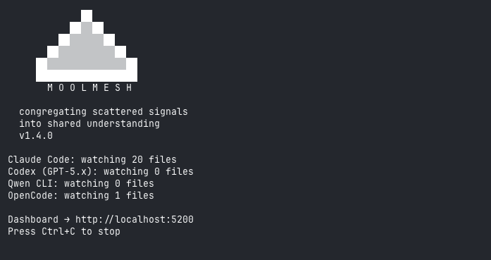

<p align="center">
  
</p>

# MoolMesh

**The context mesh for autonomous agents.**

Unified observability, telemetry, and inter-agent coordination — running entirely on your machine.

[](LICENSE)
[](https://python.org)
[](#development)
[](#)
[](https://pypi.org/project/moolmesh/)
[](README.es.md)

---

## Why MoolMesh?

Modern software development isn't human-to-keyboard anymore. It's an ecosystem of AI agents working in parallel — each with its own logs, token counters, and reasoning traces, all locked in separate silos.

When Claude Code gets stuck in a loop, your other agents don't know. When you spend tokens across four providers, you can't see which git commit justified it. When your team uses different AI tools on the same repo, nobody has the full picture.

**MoolMesh congregates what is scattered.** It auto-discovers sessions from every major AI coding agent, normalizes them into a single queryable database, and exposes that state to both humans (via a dashboard) and machines (via MCP).

Read our [Philosophy](PHILOSOPHY.md) to understand the dual axiom behind MoolMesh: **Human-First & Agent-First**.

---

## What You Get

Four views in a single browser tab:

| View | What it shows |
|------|---------------|
| **AI Sessions** | Live event feed from all agents — messages, tool calls, token usage, models |
| **Analytics** | Token consumption by provider, hourly activity, top tools, top projects |
| **Project Pulse** | PR kanban, issues list, milestones, GitHub Projects v2 board |
| **Code Timeline** | Commit feed, author stats, hot files, daily/weekly digest narratives |

Plus a **MCP server** that lets other AI agents query your session data programmatically — enabling agent-to-agent supervision and orchestration.

---

## Quick Start

```bash
# Install
pip install moolmesh

# Start the dashboard
mool dashboard
# → open http://localhost:5200
```

That's it. MoolMesh auto-discovers your AI sessions immediately. No configuration needed.

> **Running from source:**
> ```bash
> git clone https://github.com/fmicalizzi/moolmesh.git
> cd moolmesh
> python -m venv .venv && source .venv/bin/activate
> pip install -e ".[dev]"
> mool dashboard
> ```

---

## Supported Agents

| Provider | Session source | Format |
|----------|---------------|--------|
| **Claude Code** | `~/.claude/projects/` | JSONL per session + subagent logs |
| **Codex (GPT-5)** | `~/.codex/sessions/` + `state_5.sqlite` | Rollout JSONL + SQLite metadata |
| **Qwen CLI** | `~/.qwen/projects/` | JSONL per chat |
| **OpenCode** | `~/.local/share/opencode/opencode.db` | SQLite (session → message → part) |

Sessions are auto-discovered on startup. No configuration, no API keys, no cloud services.

---

## Git & GitHub Integration

Register a git repository to unlock Project Pulse and Code Timeline:

```bash
cd /path/to/your/repo
mool repo add                            # Registers the current directory
```

This ingests commit history and starts polling GitHub for issues, PRs, milestones, and Projects v2.

```bash
mool repo list                           # Show registered repos
mool repo remove                         # Unregister current repo
mool repo sync --all                     # Re-ingest full history
```

All `repo` subcommands default to the current directory when no path is given.

### GitHub token

A token is resolved automatically in this order:

1. `gh auth token` (GitHub CLI — recommended)
2. `GITHUB_TOKEN` environment variable
3. `~/.moolmesh/config.toml` → `[github] token = "..."`

For **public repos**, no token is needed — commit history works without GitHub API access.

For **private repos**, a token with `repo` scope is required. The easiest way:

```bash
gh auth login                            # Follow prompts, select repo scope
```

If you don't have the GitHub CLI, set the env var or add it to config:

```toml
# ~/.moolmesh/config.toml
[github]
token = "ghp_xxxxxxxxxxxxxxxxxxxx"
```

Without a valid token, `mool repo add` still works — it ingests local git history, but Project Pulse (issues, PRs, milestones) won't have GitHub data.

---

## MCP Server (Inter-Agent API)

MoolMesh exposes a read-only MCP server over stdio, allowing any MCP-compatible agent to query session data:

```json
{
  "mcpServers": {
    "moolmesh": {
      "command": "uv",
      "args": ["run", "/path/to/moolmesh/hub/mcp_server.py"]
    }
  }
}
```

Available tools:

| Tool | Description |
|------|-------------|
| `get_recent_events` | Latest N events across all providers |
| `get_active_sessions` | Sessions active in the last N hours |
| `get_token_usage` | Token consumption by provider |
| `get_tool_stats` | Top tools used by AI agents |
| `search_events` | Full-text search on event summaries |
| `get_project_activity` | Complete project summary with stats |

Resources: `hub://schema` (database schema), `hub://projects` (project list with stats).

The server opens SQLite in read-only mode (`?mode=ro`). It runs as a separate process (~15-20 MB RAM), independent from the dashboard.

---

## Digest Narratives

Code Timeline generates daily and weekly digests for each registered repo:

| Level | What | When |
|-------|------|------|
| **L1** | Raw SQL stats (commits, PRs, issues, LOC) | Always available |
| **L2** | Structured template with bullet points | Always available |
| **L3** | LLM-generated narrative paragraph | When an LLM provider is configured |

L3 works with any OpenAI-compatible API. Configure in `~/.moolmesh/config.toml`:

```toml
[llm]
provider = "openrouter"
api_url  = "https://openrouter.ai/api/v1"
model    = "google/gemma-4-31b-it:free"
api_key  = "sk-or-v1-..."
```

Supported providers: OpenRouter, OpenAI, Together, Groq, Ollama. If the LLM is unavailable, digests fall back to L2 automatically.

---

## Batch Reports

Generate Markdown analysis reports from the command line:

```bash
# Auto report — writes to ~/.moolmesh/reports/
mool report auto

# Full content (no truncation)
mool report auto --complete

# Filter by project or provider
mool report --project myapp --provider claude --output ./exports
```

---

## CLI Reference

```
mool <command> [options]

Commands:
  dashboard              Start the live monitoring dashboard
  daemon start           Run dashboard as a background service
  daemon stop            Stop the background service
  daemon status          Show daemon PID, uptime, log size
  daemon restart         Restart the background service
  status                 Quick alias for daemon status
  doctor                 Run system diagnostics
  install                Install mool command globally (~/.local/bin)
  report                 Generate batch Markdown analysis reports
  discover               List all discovered AI agent projects
  repo add [PATH]        Register a git repo (default: current directory)
  repo list              List registered repos with commit counts
  repo remove [PATH]     Unregister a repo (default: current directory)
  repo sync [PATH]       Re-ingest commit history

Global options:
  --version              Show version and exit

Dashboard / daemon options:
  --port PORT            Server port (default: 5200)
  --host HOST            Server host (default: localhost)
  --project NAME         Filter to project name
  --providers LIST       Comma-separated: claude,codex,qwen,opencode

Report options:
  --complete             Full-content mode: no truncation
  --output DIR           Output directory
  --provider PROVIDER    Filter by provider
```

### Health endpoint

When the dashboard is running, `GET /health` returns:

```json
{"status": "healthy", "version": "1.4.0", "uptime_seconds": 3600, "events_count": 45231}
```

---

## Architecture

```
hub/
  parsers/         JSONL + SQLite parsers for each provider
  adapters/        Normalize provider entries → unified events
  watchers/        File harvesters: discover → offset → parse → store → SSE
  harvesters/      GitHarvester (120s) + GitHubHarvester (15s/60s)
  integrations/    GitHubClient (REST + GraphQL) + LLM clients
  digests/         L1 Stats → L2 Template → L3 LLM narrative
  correlation/     AI ↔ Git links: Co-Author, issue refs, timestamps
  dashboard/       HTTP server + SSE + 4 HTML pages
  cache/           EventStore (events.db) + GitStore (github.db)
  mcp_server.py    MCP stdio server (read-only, PEP 723 inline deps)
  cli.py           CLI entry point
```

### How data flows

1. **Discovery** scans provider directories for session files
2. **Parsers** read JSONL or query SQLite into typed entries
3. **Adapters** normalize to `UnifiedEvent` with common fields
4. **Watchers** poll incrementally, store atomically in SQLite, push to SSE
5. **Dashboard** serves live feed + analytics via HTTP + Server-Sent Events

All state is persisted in SQLite. Crash-safe, exactly-once semantics via transactional offsets.

---

## Persistence

| Database | Path | Contents |
|----------|------|----------|
| `events.db` | `~/.moolmesh/events.db` | AI session events, file offsets, SSE replay buffer |
| `github.db` | `~/.moolmesh/github.db` | Repos, commits, issues, PRs, milestones, digests |

Both databases are created automatically. Schema migrates on startup.

---

## Reliability

- **Zero-gap SSE** — `id:` fields enable browser reconnection with replay from SQLite
- **Transactional offsets** — events and file positions update in a single transaction
- **Git crash safety** — exceptions caught per-repo, 60s timeout on `git fetch`
- **GitHub ETags** — 304 responses don't consume rate limit
- **Digest fallback** — LLM unavailable → L2 template, no repos → L1 stats
- **OpenCode WAL safety** — read-only SQLite with timeout, never blocks OpenCode writes

---

## Roadmap

MoolMesh started with coding agents but the vision is broader — any autonomous agent that generates observable signals belongs in the mesh.

| Status | Scope | Details |
|--------|-------|---------|
| **Shipping** | Claude Code, Codex (GPT-5), Qwen CLI, OpenCode | Full session parsing, live monitoring, MCP |
| **Planned** | Aider, Pi, GitHub Copilot CLI, Antigravity CLI | Adapters in progress — PRs welcome |
| **Future** | Hermes, Odyssey, Goose, community requests | Open an issue to propose a new provider |
| **Vision** | Cross-repo model usage analytics | Monitor AI token consumption and agent activity across an organization's repositories |

The long-term goal: a unified observability layer for any agent ecosystem — coding, ops, research, orchestration — so teams can see what their agents are doing, what they're spending, and whether they're stepping on each other.

---

## Limitations

- **macOS optimal, Linux supported** — macOS uses `kqueue` for instant detection; Linux uses polling (~1s)
- **No authentication** — dashboard binds to localhost. Use a reverse proxy for remote access
- **Single-user design** — not intended for multi-user or server deployment
- **Python 3.11+** — uses `tomllib` from stdlib
- **GitHub Projects v2 only** — classic Projects (v1) not supported

---

## Development

```bash
# Run all tests
pytest tests/ -v

# Run with coverage
pytest tests/ -v --cov=hub
```

509 tests. Zero external dependencies. Python stdlib + SQLite.

See [CONTRIBUTING.md](CONTRIBUTING.md) for guidelines.

---

## License

[MIT](LICENSE) — Your telemetry is yours.
