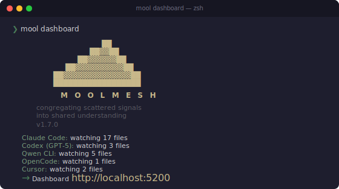

<p align="center">
  
</p>

# MoolMesh

**The context mesh for autonomous agents.**

Unified observability, telemetry, and inter-agent coordination — running entirely on your machine.

[](LICENSE)
[](https://python.org)
[](#development)
[](#)
[](https://pypi.org/project/moolmesh/)
[](README.es.md)

---

## Why MoolMesh?

Modern software development isn't human-to-keyboard anymore. It's an ecosystem of AI agents working in parallel — each with its own logs, token counters, and reasoning traces, all locked in separate silos.

When Claude Code gets stuck in a loop, your other agents don't know. When you spend tokens across four providers, you can't see which git commit justified it. When your team uses different AI tools on the same repo, nobody has the full picture.

**MoolMesh congregates what is scattered.** It auto-discovers sessions from every major AI coding agent, normalizes them into a single queryable database, and exposes that state to both humans (via a dashboard) and machines (via MCP).

Read our [Philosophy](PHILOSOPHY.md) to understand the dual axiom behind MoolMesh: **Human-First & Agent-First**.

---

## What You Get

Four views in a single browser tab:

| View | What it shows |
|------|---------------|
| **AI Sessions** | Live event feed from all agents — messages, tool calls, token usage, models |
| **Analytics** | Token consumption by provider, hourly activity, top tools, top projects |
| **Project Pulse** | PR kanban, issues list, milestones, GitHub Projects v2 board |
| **Code Timeline** | Commit feed, author stats, hot files, daily/weekly digest narratives |

Plus a **MCP server** that lets other AI agents query your session data programmatically — enabling agent-to-agent supervision and orchestration.

---

## Quick Start

```bash
# Install
pip install moolmesh

# Start the dashboard
mool dashboard
# → open http://localhost:5200
```

That's it. MoolMesh auto-discovers your AI sessions immediately. No configuration needed.

> **Running from source:**
> ```bash
> git clone https://github.com/fmicalizzi/moolmesh.git
> cd moolmesh
> python -m venv .venv && source .venv/bin/activate
> pip install -e ".[dev]"
> mool dashboard
> ```

---

## Production Install

For system-wide access (run `mool` from any directory):

```bash
# Recommended — isolated venv, global binary
pipx install moolmesh

# Or with pip (requires a venv on modern Python)
pip install moolmesh
```

### systemd service (Linux)

Use `mool dashboard` (foreground) as the entry point — MoolMesh auto-detects systemd and skips the double-fork:

```ini
# ~/.config/systemd/user/moolmesh.service
[Unit]
Description=MoolMesh Dashboard
After=network.target

[Service]
Type=simple
ExecStart=%h/.local/bin/mool daemon start --port 5200
Restart=on-failure
RestartSec=5

[Install]
WantedBy=default.target
```

```bash
systemctl --user daemon-reload
systemctl --user enable --now moolmesh
systemctl --user status moolmesh
```

> **Note:** `mool daemon start` auto-detects systemd (`$INVOCATION_ID`) and stays in the foreground, so `Type=simple` works correctly. Outside systemd, it double-forks as usual.

---

## Supported Agents

| Provider | Session source | Format |
|----------|---------------|--------|
| **Claude Code** | `~/.claude/projects/` | JSONL per session + subagent logs |
| **Codex (GPT-5)** | `~/.codex/sessions/` + `state_5.sqlite` | Rollout JSONL + SQLite metadata |
| **Qwen CLI** | `~/.qwen/projects/` | JSONL per chat |
| **OpenCode** | `~/.local/share/opencode/opencode.db` | SQLite (session → message → part) |
| **Cursor** | `~/Library/Application Support/Cursor/User/` (macOS) | SQLite (`state.vscdb` key-value: composer bubbles) |

Sessions are auto-discovered on startup. No configuration, no API keys, no cloud services.

---

## Git & GitHub Integration

Register a git repository to unlock Project Pulse and Code Timeline:

```bash
cd /path/to/your/repo
mool repo add                            # Registers the current directory
```

This ingests commit history and starts polling GitHub for issues, PRs, milestones, and Projects v2.

```bash
mool repo list                           # Show registered repos
mool repo remove                         # Unregister current repo
mool repo sync --all                     # Re-ingest full history
```

All `repo` subcommands default to the current directory when no path is given.

### GitHub token

A token is resolved automatically in this order:

1. `gh auth token` (GitHub CLI — recommended)
2. `GITHUB_TOKEN` environment variable
3. `~/.moolmesh/config.toml` → `[github] token = "..."`

For **public repos**, no token is needed — commit history works without GitHub API access.

For **private repos**, a token with `repo` scope is required. The easiest way:

```bash
gh auth login                            # Follow prompts, select repo scope
```

If you don't have the GitHub CLI, set the env var or add it to config:

```toml
# ~/.moolmesh/config.toml
[github]
token = "ghp_xxxxxxxxxxxxxxxxxxxx"
```

Without a valid token, `mool repo add` still works — it ingests local git history, but Project Pulse (issues, PRs, milestones) won't have GitHub data.

---

## MCP Server (Inter-Agent API)

MoolMesh exposes a read-only MCP server over stdio, allowing any MCP-compatible agent to query session data.

The MCP server uses [PEP 723](https://peps.python.org/pep-0723/) inline script metadata for its dependencies (the `mcp` package). This keeps MoolMesh itself zero-dependency while allowing the MCP server to run standalone.

### Quick setup

```bash
mool mcp setup                  # Claude Code (global, user scope)
mool mcp setup claude-desktop   # Claude Desktop (macOS/Linux/Windows)
mool mcp setup cursor           # Cursor IDE
mool mcp setup codex            # Codex (OpenAI CLI)
mool mcp setup qwen             # Qwen CLI
mool mcp setup opencode         # OpenCode
mool mcp setup json             # Print config JSON for any MCP client
```

The command auto-detects your install method (pipx/pip/source), finds the correct Python and server paths, and checks for the `mcp` dependency. If `mcp` is missing it shows the exact command to install it, or use `--install-deps` to install automatically:

```bash
mool mcp setup --install-deps   # Also runs: pipx inject moolmesh mcp
```

Use `--dry-run` to preview changes without modifying any config files.

### Manual configuration

If you prefer to configure manually, here are the two common setups:

**From source** (requires [uv](https://docs.astral.sh/uv/)):

```json
{
  "mcpServers": {
    "moolmesh": {
      "command": "uv",
      "args": ["run", "/path/to/moolmesh/hub/mcp_server.py"]
    }
  }
}
```

**From pipx/pip** (requires `pipx inject moolmesh mcp`):

```json
{
  "mcpServers": {
    "moolmesh": {
      "command": "/path/to/pipx/venvs/moolmesh/bin/python",
      "args": ["/path/to/pipx/venvs/moolmesh/lib/.../hub/mcp_server.py"]
    }
  }
}
```

### Available tools

| Tool | Description |
|------|-------------|
| `get_recent_events` | Latest N events across all providers |
| `get_active_sessions` | Sessions active in the last N hours |
| `get_token_usage` | Token consumption by provider |
| `get_tool_stats` | Top tools used by AI agents |
| `search_events` | Full-text search on event summaries |
| `get_project_activity` | Complete project summary with stats |

Resources: `hub://schema` (database schema), `hub://projects` (project list with stats).

The server opens SQLite in read-only mode (`?mode=ro`). It runs as a separate process (~15-20 MB RAM), independent from the dashboard.

---

## Digest Narratives

Code Timeline generates daily and weekly digests for each registered repo:

| Level | What | When |
|-------|------|------|
| **L1** | Raw SQL stats (commits, PRs, issues, LOC) | Always available |
| **L2** | Structured template with bullet points | Always available |
| **L3** | LLM-generated narrative paragraph | When an LLM provider is configured |

L3 works with any OpenAI-compatible API. Configure in `~/.moolmesh/config.toml`:

```toml
[llm]
provider = "openrouter"
api_url  = "https://openrouter.ai/api/v1"
model    = "google/gemma-4-31b-it:free"
api_key  = "sk-or-v1-..."
```

Supported providers: OpenRouter, OpenAI, Together, Groq, Ollama. If the LLM is unavailable, digests fall back to L2 automatically.

---

## Batch Reports

Generate Markdown analysis reports from the command line:

```bash
# Auto report — writes to ~/.moolmesh/reports/
mool report auto

# Full content (no truncation)
mool report auto --complete

# Filter by project or provider
mool report --project myapp --provider claude --output ./exports
```

---

## CLI Reference

```
mool <command> [options]

Commands:
  dashboard              Start the live monitoring dashboard
  daemon start           Run dashboard as a background service
  daemon stop            Stop the background service
  daemon status          Show daemon PID, uptime, log size
  daemon restart         Restart the background service
  status [--json]        Quick alias for daemon status
  mcp setup [TARGET]     Configure MCP server (claude-code|claude-desktop|cursor|codex|qwen|opencode|json)
  doctor                 Run system diagnostics
  install                Install mool command globally (~/.local/bin)
  report                 Generate batch Markdown analysis reports
  discover [--json]      List all discovered AI agent projects
  repo add [PATH]        Register a git repo (default: current directory)
  repo list              List registered repos with commit counts
  repo remove [PATH]     Unregister a repo (default: current directory)
  repo sync [PATH]       Re-ingest commit history
  query events           Recent events as JSON
  query sessions         Active sessions as JSON
  query tokens           Token usage by provider as JSON
  query tools            Top tools used by agents as JSON
  query search TEXT      Search events by text as JSON
  query project NAME     Project activity summary as JSON

Global options:
  --version              Show version and exit

Dashboard / daemon options:
  --port PORT            Server port (default: 5200)
  --host HOST            Server host (default: localhost)
  --project NAME         Filter to project name
  --providers LIST       Comma-separated: claude,codex,qwen,opencode

Report options:
  --complete             Full-content mode: no truncation
  --output DIR           Output directory
  --provider PROVIDER    Filter by provider
```

### Agent-friendly CLI (`mool query`)

For agents that don't have MCP support, `mool query` exposes the same data as the MCP server via stdout JSON:

```bash
# Get the last 10 events
mool query events -n 10

# Active sessions in the last 2 hours
mool query sessions --hours 2

# Token consumption by provider since a date
mool query tokens --since 2026-06-01

# Top tools used in a project
mool query tools --project moolmesh -n 5

# Search for events mentioning "daemon"
mool query search "daemon" --provider claude

# Full project activity summary
mool query project moolmesh
```

All output is valid JSON — pipe to `jq`, parse with any language, or use from agent subprocess calls. Also: `mool status --json` and `mool discover --json` for machine-parseable output.

### Health endpoint

When the dashboard is running, `GET /health` returns:

```json
{"status": "healthy", "version": "1.4.0", "uptime_seconds": 3600, "events_count": 45231}
```

---

## Architecture

```
hub/
  parsers/         JSONL + SQLite parsers for each provider
  adapters/        Normalize provider entries → unified events
  watchers/        File harvesters: discover → offset → parse → store → SSE
  harvesters/      GitHarvester (120s) + GitHubHarvester (15s/60s)
  integrations/    GitHubClient (REST + GraphQL) + LLM clients
  digests/         L1 Stats → L2 Template → L3 LLM narrative
  correlation/     AI ↔ Git links: Co-Author, issue refs, timestamps
  dashboard/       HTTP server + SSE + 4 HTML pages
  cache/           EventStore (events.db) + GitStore (github.db)
  mcp_server.py    MCP stdio server (read-only, PEP 723 inline deps)
  cli.py           CLI entry point
```

### How data flows

1. **Discovery** scans provider directories for session files
2. **Parsers** read JSONL or query SQLite into typed entries
3. **Adapters** normalize to `UnifiedEvent` with common fields
4. **Watchers** poll incrementally, store atomically in SQLite, push to SSE
5. **Dashboard** serves live feed + analytics via HTTP + Server-Sent Events

All state is persisted in SQLite. Crash-safe, exactly-once semantics via transactional offsets.

---

## Persistence

| Database | Path | Contents |
|----------|------|----------|
| `events.db` | `~/.moolmesh/events.db` | AI session events, file offsets, SSE replay buffer |
| `github.db` | `~/.moolmesh/github.db` | Repos, commits, issues, PRs, milestones, digests |

Both databases are created automatically. Schema migrates on startup.

---

## Reliability

- **Zero-gap SSE** — `id:` fields enable browser reconnection with replay from SQLite
- **Transactional offsets** — events and file positions update in a single transaction
- **Git crash safety** — exceptions caught per-repo, 60s timeout on `git fetch`
- **GitHub ETags** — 304 responses don't consume rate limit
- **Digest fallback** — LLM unavailable → L2 template, no repos → L1 stats
- **OpenCode WAL safety** — read-only SQLite with timeout, never blocks OpenCode writes

---

## Roadmap

MoolMesh started with coding agents but the vision is broader — any autonomous agent that generates observable signals belongs in the mesh.

| Status | Version | Scope |
|--------|---------|-------|
| **Shipped** | v1.6 | 4 providers (Claude, Codex, Qwen, OpenCode), session metadata, full text export, full-text search, git branch correlation, cross-session linking |
| **Planned** | v1.7 | New providers: Aider, GitHub Copilot CLI, Pi |
| **Planned** | v1.8 | Provider template & contributor guide |
| **Future** | v2.0 | Autonomous agent support: Hermes, Odyssey, Goose |
| **Vision** | v2.x | Organization-scale observability, multi-user, cross-repo analytics |

See [ROADMAP.md](ROADMAP.md) for detailed plans, open questions, and design principles.

---

## Limitations

- **macOS optimal, Linux supported** — macOS uses `kqueue` for instant detection; Linux uses polling (~1s)
- **No authentication** — dashboard binds to localhost. Use a reverse proxy for remote access
- **Single-user design** — not intended for multi-user or server deployment
- **Python 3.11+** — uses `tomllib` from stdlib
- **GitHub Projects v2 only** — classic Projects (v1) not supported
- **Cursor caveats** — Cursor stores no per-message timestamps locally (MoolMesh approximates them from composer metadata) and its on-disk schema is reverse-engineered, so a Cursor update may temporarily reduce ingestion until the parser is adjusted

---

## Development

```bash
# Run all tests
pytest tests/ -v

# Run with coverage
pytest tests/ -v --cov=hub
```

593 tests. Zero external dependencies. Python stdlib + SQLite.

See [CONTRIBUTING.md](CONTRIBUTING.md) for guidelines.

---

## License

[MIT](LICENSE) — Your telemetry is yours.
